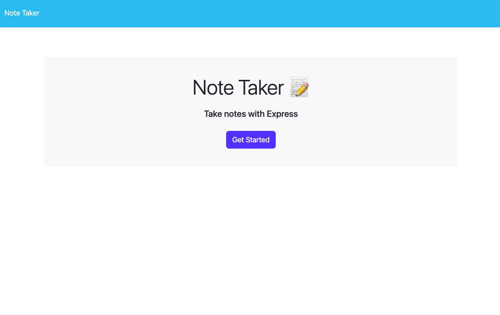
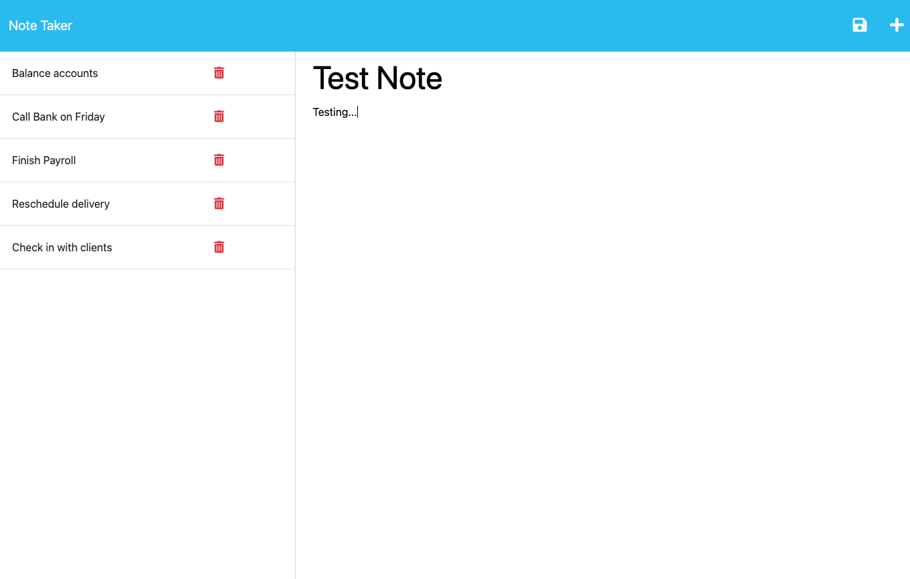

# UTA-bootcamp-challenge11
## Description 
This application is a note taker. It can be used to write and take noets. The front end of this project was provided by UT. The backend was created using routes. When visitng the URL, the user should be presented with the homepage, then redirected to the note taking page. On this page, the user should be able to add, save, and delete notes. 
## Table of Contents
- [Installation](#installation)
- [Usage](#usage)
- [License](#license)
## Installation
To install on locally:
1. Copy the SSH key from the Repo into a folder on your own computer
2. Once the files are installed, open the folder in your personal workspace
3. For this application you will have to install express in the package.json file
4. Open the intergrated terminal on the server.js file and run node server.js
5. Navigate to the local host url in your browser and use the application

## Usage
[Link to webpage]

## License
This project uses an MIT license. For more information click the license badge at the top of the README.
